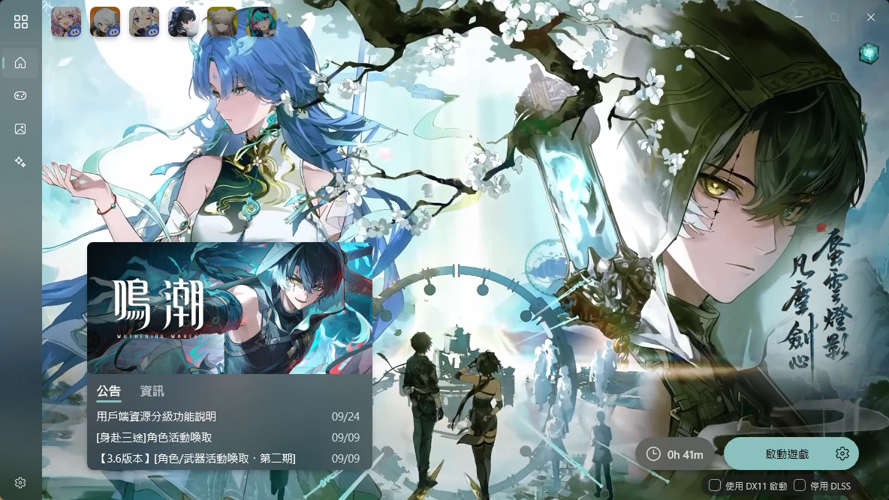

繁體中文 | 上游原版介紹：[English](https://github.com/Scighost/Starward#readme) | [简体中文](./docs/README.zh-CN.md) | [Tiếng Việt](./docs/README.vi-VN.md) | [日本語](./docs/README.ja-JP.md) | [ภาษาไทย](./docs/README.th-TH.md) | [Русский](./docs/README.ru-RU.md)


# Starward（分支版）

> **Starward** 取自星穹鐵道的標語「願此行，終抵群星」（May This Journey Lead Us **Starward**）。

這是 [Scighost/Starward](https://github.com/Scighost/Starward) 的分支。上游是取代 HoYoPlay（米哈遊啟動器）的開源第三方啟動器；本分支把遊戲相關的邏輯改寫成可擴充的「遊戲供應商」架構，並在米哈遊的遊戲之外，額外支援 **鳴潮**、**明日方舟：終末地** 與 **異環**。

目前以上游 0.18.2 為基礎，版本號為 `0.18.2-odyssey.N`。


## 支援的遊戲

| 遊戲 | 伺服器 | 下載／更新／修復 | 啟動 | 抽卡紀錄 |
| --- | --- | :---: | :---: | --- |
| 原神 | 國服、國際服、B 服 | ✅ | ✅ | ✅ |
| 崩壞：星穹鐵道 | 國服、國際服、B 服 | ✅ | ✅ | ✅ |
| 絕區零 | 國服、國際服、B 服 | ✅ | ✅ | ✅ |
| 鳴潮 | 國際服 | ❌ 請用官方啟動器 | ✅ | ✅ 讀取遊戲留下的授權網址 |
| 明日方舟：終末地 | GRYPHLINK 安裝的版本 | ❌ 請用官方啟動器 | ✅ | ✅ 讀取遊戲留下的授權網址 |
| 異環 | 台服 | ❌ 請用官方啟動器 | ✅ 經由官方登入外殼 | ✅ 匯入 [nte-exporter](https://github.com/Golumpa/nte-exporter) 的 JSON |

本分支不再提供崩壞3。

### 新增三款遊戲的功能

- **自動搜尋**：從官方啟動器的登錄檔與設定檔找到安裝位置，遊戲圖示直接取自已安裝的執行檔。
- **遊玩時間、截圖頁、自訂啟動參數、無邊框視窗、第三方工具**：與米哈遊的遊戲相同。
- **遊戲設定**：可調整解析度與視窗模式，只改遊戲自己寫過的鍵，寫入前會先備份。
- **啟動頁**
  - 背景：鳴潮與終末地走官方接口（含動態背景），異環讀官方更新程式的檔案清單。
  - 橫幅與公告：鳴潮、終末地。
  - 版本提示：鳴潮與終末地提示官方公布的新遊戲版本（終末地僅限官方國際服渠道，Epic、Steam 等來源不會提示），異環提示官方啟動器有新版本。
  - 啟動選項：鳴潮可「使用 DX11」與「停用 DLSS」，終末地可「使用 DX11」。
  - 鳴潮角色卡片：顯示聯覺等級、結晶波片、活躍度等資訊，讀的是遊戲留在本機的登入紀錄，不需要另外登入（僅國際服）。
- **抽卡紀錄**
  - 內建鳴潮（五星 80 抽、新手喚取 50 抽）與終末地（特許尋訪、武庫申領）的保底規則，限定池會標出 UP。
  - 角色與武器圖示分別來自 encore.moe（鳴潮）、AKEDatabase（終末地）、NTE_Assets（異環）。
  - 雲遊戲、米遊社同步與 UIGF 只適用於米哈遊的遊戲。

各版本的詳細變更請見 [Releases](https://github.com/funyhao0930/Starward/releases)。


## 安裝

裝置需求：

- Windows 10 1809（17763）以上。
- 已安裝 [WebView2 Runtime](https://developer.microsoft.com/microsoft-edge/webview2)。
- 已安裝 [WebP 影像延伸模組](https://apps.microsoft.com/detail/9pg2dk419drg)。系統通常已內建；若啟動頁背景或鳴潮的抽卡圖示顯示不出來，請確認有安裝。
- 建議在系統設定中開啟 **透明效果** 與 **動畫效果**，體驗較好。

到本分支的 [GitHub Releases](https://github.com/funyhao0930/Starward/releases) 下載對應處理器架構的檔案：

| 檔案 | 說明 |
| --- | --- |
| `Starward_Setup_<版本>_x64.exe` | 安裝版，Intel／AMD 處理器 |
| `Starward_Setup_<版本>_arm64.exe` | 安裝版，ARM64 處理器 |
| `Starward_Portable_<版本>_x64.7z` | 免安裝版，Intel／AMD 處理器 |
| `Starward_Portable_<版本>_arm64.7z` | 免安裝版，ARM64 處理器 |

> [!NOTE]
> 本分支的建置關閉了自動更新檢查，不會被上游版本覆蓋掉；有新版時請回到 Releases 下載。


## 開發

需要：

- [.NET 10 SDK](https://dotnet.microsoft.com/download)（版本見 [global.json](./global.json)）
- Visual Studio 2026，並勾選以下工作負載：
  - .NET 桌面開發
  - C++ 桌面開發
  - 通用 Windows 平台開發

方案檔是 [Starward.slnx](./Starward.slnx)。執行測試：

```bash
dotnet test tests/Starward.Core.Tests -c Release
```

在本機建置出可執行的版本：

```bash
./build.ps1 -Architecture x64 -Version 0.0.1
```

### 新增遊戲

每款遊戲由一個「遊戲供應商」描述，放在 [src/Starward.Core/Games](./src/Starward.Core/Games) 下：`HoYo`（米哈遊）、`Kuro`（鳴潮）、`Gryphline`（終末地）、`Hotta`（異環）。供應商以 `GameCapability` 宣告自己支援哪些功能（啟動、搜尋、截圖、抽卡、遊戲設定……），介面會依此決定顯示哪些頁面與按鈕。

### 發佈

推送標籤（例如 `0.18.2-odyssey.7`）就會觸發 [release.yml](./.github/workflows/release.yml)，建置 x64 與 arm64 的安裝版與免安裝版並建立 GitHub Release。每個版本都必須先在 [.github/release-notes](./.github/release-notes) 寫好同名的更新說明（`<版本>.md`），缺了會在編譯前擋下。


## 在地化

介面文字的翻譯在上游的 [Crowdin](https://crowdin.com/project/starward) 進行，歡迎協助翻譯與校對。詳見[在地化指南](./docs/Localization.md)。


## 致謝

本分支的一切都建立在 [@Scighost](https://github.com/Scighost) 與上游所有貢獻者、翻譯者的成果之上。若覺得 Starward 好用，歡迎到 https://donate.scighost.com 支持上游作者。

上游專案另外感謝：

- [@neon-nyan](https://github.com/neon-nyan) 的 [Collapse](https://github.com/neon-nyan/Collapse)，Starward 的靈感與設計直接來自這個專案。
- [Snap Hutao](https://github.com/DGP-Studio/Snap.Hutao) 的主要開發者 [@Lightczx](https://github.com/Lightczx)。
- [CloudFlare](https://www.cloudflare.com/) 提供的免費 CDN，以及 [SignPath Foundation](https://signpath.org/) 為開源專案提供的免費程式碼簽章（僅適用於上游的官方版本）。

抽卡圖示與名稱對照來自 [encore.moe](https://encore.moe)、AKEDatabase、NTE_Assets 與 [nte-exporter](https://github.com/Golumpa/nte-exporter)。本專案使用的其他函式庫請見[第三方程式庫](./docs/ThirdParty.md)。


## 截圖


